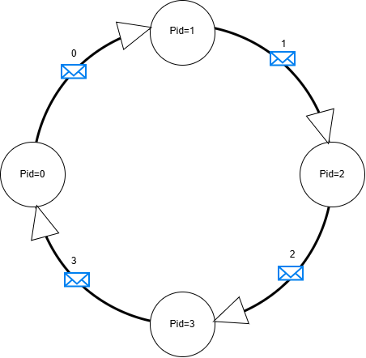

## Q1 — Signification de `-np`
### Question
Que représente l'argument `-np 4` dans la commande suivante ?
```bash
mpirun -np 4 ./hello
``` 
### Réponse 
Apres l'exuction du programme l'argument <code>-np 4</code> indique a MPI de lancer 4 processus MPI exécutant le programme <code>./hello</code><br>

### Obsérvation 
les processus auront alors des identifiants allant de 0 à 3 . <br>
l'ordre d'affichage des processus n'est pas forcément 0,1,2,3 car les processus s'exécutent en parallèle et leur ordre n'est pas déterministe . <br>
## Q2 — modification du programme
### Question
Modifiez le programme précédent pour que seuls les processus avec un identifiant pair affichent le message 'Bonjour'.
### Réponse 
```C++
if(pid%2==0){
      cout << "Bonjour ! Je suis le processus " 
       << pid << " sur " << nprocs
       << " processus." << endl;
   }
```   
## Q3 — modification du programme
### Question
Q3. Modifiez votre programme pour que tous les processus d'identifiant pair affiche un message donné en ligne de commande et exécutez le avec 

```bash
$ mpirun -np 4 ./hello "Jeudi 7 oct"
```

Comment s'effectue la diffusion des arguments en ligne de commande sur les différents processus ?
### Réponse 
Les arguments passés en ligne de commande sont accessibles aux
processus après l'initialisation de MPI avec :

```cpp
MPI_Init(&argc, &argv);
``` 
# code pour afficher le message: 
```cpp
    if (argc <2){
        cout << "Usage " << argv[0] << " message " << endl;
    }
    else{
    
    if(pid%2==0){
      cout << "Bonjour ! Je suis le processus " 
       << pid << " sur " << nprocs <<" processus.\n le message est : " << argv[1]
       << endl;
    }
    }
```    
### Observation

Les différents processus MPI s'exécutent de manière concurrente.
Lorsqu'ils écrivent tous sur la sortie standard avec `cout`, l'ordre
des affichages n'est donc pas garanti.
## Exercice 2 — Échanges simples entre processus

### Q4
Modifiez le programme pour que chaque processus envoie son identifiant à son voisin de droite. On supposera que les processus forment un anneau et que le voisin de droite du processus d'identifiant `nprocs - 1` est `0`.



### Réponse
```C++
  switch (pid)
  {
    case 1:
        MPI_Send(&a,1,MPI_INT,2,tag,MPI_COMM_WORLD);//envoyer à 2
        MPI_Recv(&a,1,MPI_INT,0,tag,MPI_COMM_WORLD,MPI_STATUS_IGNORE);// recevoir de 0
      break;
    case 2:
        MPI_Send(&a,1,MPI_INT,3,tag,MPI_COMM_WORLD);//envoyer à 3
        MPI_Recv(&a,1,MPI_INT,1,tag,MPI_COMM_WORLD,MPI_STATUS_IGNORE);// recevoir de 1
      break;
    case 3:
        MPI_Send(&a,1,MPI_INT,0,tag,MPI_COMM_WORLD);//envoyer à 0 
        MPI_Recv(&a,1,MPI_INT,2,tag,MPI_COMM_WORLD,MPI_STATUS_IGNORE);// recevoir de 2
      break;
    default:
        MPI_Send(&a,1, MPI_INT, 1, tag, MPI_COMM_WORLD);// envoyer à 1 
        MPI_Recv(&a,1,MPI_INT,3,tag,MPI_COMM_WORLD,MPI_STATUS_IGNORE);// recevoir de 3 
      break;
  }
```
### Q5
Modifiez le programme pour que désormais chaque processus envoie un tableau dont la taille `n` est donnée en ligne de commande. Chaque processus aura au préalable initialisé son tableau, par exemple avec son identifiant.

### Réponse
```C++
int main(int argc, char **argv)
{
  int pid, nprocs,n;
  int *tab;

  MPI_Init(&argc, &argv);
  MPI_Comm_rank(MPI_COMM_WORLD, &pid);
  MPI_Comm_size(MPI_COMM_WORLD, &nprocs);
  if(argc!=2)
  {
    cout<<"Usage: "<< argv[0] << " " << "<taille du tableau>"<<"\n";
    MPI_Finalize();
    return 1 ;
  }
  else
  {
    n=atoi(argv[1]);
    if(n<=0){
        cout<<"Erreur : taille invalide \n";
        MPI_Finalize();
        return 2 ;
    }
    tab=(int*)malloc(atoi(argv[1])*sizeof(int));
    if(tab==NULL){
        cout<<"Erreur : alocation mémoire échoué \n";
        MPI_Finalize();
        return 3;
        
    }
    else{
        for(int i = 0 ; i<n ; i++)tab[i]=pid;
        switch (pid)
        {
            case 1:
                MPI_Send(tab,n,MPI_INT,2,tag,MPI_COMM_WORLD);//envoyer à 2
                MPI_Recv(tab,n,MPI_INT,0,tag,MPI_COMM_WORLD,MPI_STATUS_IGNORE);// recevoir de 0
                break;
            case 2:
                MPI_Send(tab,n,MPI_INT,3,tag,MPI_COMM_WORLD);//envoyer à 3
                MPI_Recv(tab,n,MPI_INT,1,tag,MPI_COMM_WORLD,MPI_STATUS_IGNORE);// recevoir de 1
            break;
            case 3:
                MPI_Send(tab,n,MPI_INT,0,tag,MPI_COMM_WORLD);//envoyer à 0 
                MPI_Recv(tab,n,MPI_INT,2,tag,MPI_COMM_WORLD,MPI_STATUS_IGNORE);// recevoir de 2
            break;
            default:
                MPI_Send(tab,n, MPI_INT, 1, tag, MPI_COMM_WORLD);// envoyer à 1 
                MPI_Recv(tab,n,MPI_INT,3,tag,MPI_COMM_WORLD,MPI_STATUS_IGNORE);// recevoir de 3 
            break;
        }
        cout << "Bonjour ! Je suis le processus " 
       << pid << " sur " << nprocs <<" processus.[";
       for(int i=0; i<n; i++){
        cout<< tab[i];
        if(i<n-1)cout<<", ";
       }
       cout<<"]\n";

    }
 }
  MPI_Finalize();
  return 0;
}
```
#### Codes de retour

- <span style="color:green">`0` — Succès : exécution normale du programme.</span>
- <span style="color:red">`1` — Erreur : argument manquant.</span>
- <span style="color:red">`2` — Erreur : valeur de `n` invalide.</span>
- <span style="color:red">`3` — Erreur : échec de l'allocation mémoire.</span>

#### Question complémentaire
Que se passe-t-il si vous augmentez la taille du tableau ? Pourquoi ?

### Réponse
#### Que se passe-t-il si vous augmentez la taille du tableau ? Pourquoi ?

Lorsque la taille du tableau devient suffisamment grande, le programme peut se bloquer.<br>

Avec `MPI_Send`, le comportement dépend notamment de la taille du message.<br>
Pour les petits messages, MPI peut utiliser une bufferisation interne, ce qui permet à l'envoi de se terminer rapidement.<br>

Pour les messages plus grands, l'envoi peut attendre que le processus destinataire ait commencé sa réception.<br>

Dans un anneau où tous les processus exécutent d'abord `MPI_Send` avant `MPI_Recv`, chaque processus peut attendre <br>son voisin, ce qui provoque un interblocage.<br>
### Q6
Proposez une solution en utilisant la routine d'envoi bloquant `MPI_Ssend`.

### Réponse

#### Question complémentaire
Comment peut-on éviter l'interblocage ?

### Réponse

#### Question complémentaire
Pourquoi est-il nécessaire d'avoir un deuxième tableau pour recevoir le message de son voisin de gauche ?

### Réponse
### Q7
Proposez une nouvelle solution en utilisant la routine `MPI_Sendrecv_replace` qui permet de gérer à la fois l'émission et la réception dans le tableau initial.

### Réponse