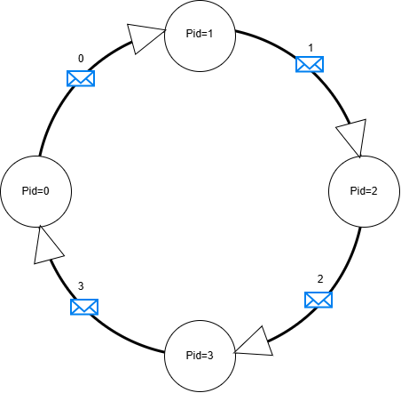

## Q1 — Signification de `-np`
### Question
Que représente l'argument `-np 4` dans la commande suivante ?
```bash
mpirun -np 4 ./hello
``` 
### Réponse 
Apres l'exuction du programme l'argument <code>-np 4</code> indique a MPI de lancer 4 processus MPI exécutant le programme <code>./hello</code><br>

### Obsérvation 
les processus auront alors des identifiants allant de 0 à 3 . <br>
l'ordre d'affichage des processus n'est pas forcément 0,1,2,3 car les processus s'exécutent en parallèle et leur ordre n'est pas déterministe . <br>
## Q2 — modification du programme
### Question
Modifiez le programme précédent pour que seuls les processus avec un identifiant pair affichent le message 'Bonjour'.
### Réponse 
```C++
if(pid%2==0){
      cout << "Bonjour ! Je suis le processus " 
       << pid << " sur " << nprocs
       << " processus." << endl;
   }
```   
## Q3 — modification du programme
### Question
Q3. Modifiez votre programme pour que tous les processus d'identifiant pair affiche un message donné en ligne de commande et exécutez le avec 

```bash
$ mpirun -np 4 ./hello "Jeudi 7 oct"
```

Comment s'effectue la diffusion des arguments en ligne de commande sur les différents processus ?
### Réponse 
Les arguments passés en ligne de commande sont accessibles aux
processus après l'initialisation de MPI avec :

```cpp
MPI_Init(&argc, &argv);
``` 
# code pour afficher le message: 
```cpp
    if (argc <2){
        cout << "Usage " << argv[0] << " message " << endl;
    }
    else{
    
    if(pid%2==0){
      cout << "Bonjour ! Je suis le processus " 
       << pid << " sur " << nprocs <<" processus.\n le message est : " << argv[1]
       << endl;
    }
    }
```    
### Observation

Les différents processus MPI s'exécutent de manière concurrente.
Lorsqu'ils écrivent tous sur la sortie standard avec `cout`, l'ordre
des affichages n'est donc pas garanti.
## Exercice 2 — Échanges simples entre processus

### Q4
Modifiez le programme pour que chaque processus envoie son identifiant à son voisin de droite. On supposera que les processus forment un anneau et que le voisin de droite du processus d'identifiant `nprocs - 1` est `0`.



### Réponse
```C++
  switch (pid)
  {
    case 1:
        MPI_Send(&a,1,MPI_INT,2,tag,MPI_COMM_WORLD);//envoyer à 2
        MPI_Recv(&a,1,MPI_INT,0,tag,MPI_COMM_WORLD,MPI_STATUS_IGNORE);// recevoir de 0
      break;
    case 2:
        MPI_Send(&a,1,MPI_INT,3,tag,MPI_COMM_WORLD);//envoyer à 3
        MPI_Recv(&a,1,MPI_INT,1,tag,MPI_COMM_WORLD,MPI_STATUS_IGNORE);// recevoir de 1
      break;
    case 3:
        MPI_Send(&a,1,MPI_INT,0,tag,MPI_COMM_WORLD);//envoyer à 0 
        MPI_Recv(&a,1,MPI_INT,2,tag,MPI_COMM_WORLD,MPI_STATUS_IGNORE);// recevoir de 2
      break;
    default:
        MPI_Send(&a,1, MPI_INT, 1, tag, MPI_COMM_WORLD);// envoyer à 1 
        MPI_Recv(&a,1,MPI_INT,3,tag,MPI_COMM_WORLD,MPI_STATUS_IGNORE);// recevoir de 3 
      break;
  }
```
### Q5
Modifiez le programme pour que désormais chaque processus envoie un tableau dont la taille `n` est donnée en ligne de commande. Chaque processus aura au préalable initialisé son tableau, par exemple avec son identifiant.

### Réponse
```C++
int main(int argc, char **argv)
{
  int pid, nprocs,n;
  int *tab;

  MPI_Init(&argc, &argv);
  MPI_Comm_rank(MPI_COMM_WORLD, &pid);
  MPI_Comm_size(MPI_COMM_WORLD, &nprocs);
  if(argc!=2)
  {
    cout<<"Usage: "<< argv[0] << " " << "<taille du tableau>"<<"\n";
    MPI_Finalize();
    return 1 ;
  }
  else
  {
    n=atoi(argv[1]);
    if(n<=0){
        cout<<"Erreur : taille invalide \n";
        MPI_Finalize();
        return 2 ;
    }
    tab=(int*)malloc(atoi(argv[1])*sizeof(int));
    if(tab==NULL){
        cout<<"Erreur : alocation mémoire échoué \n";
        MPI_Finalize();
        return 3;
        
    }
    else{
        for(int i = 0 ; i<n ; i++)tab[i]=pid;
        switch (pid)
        {
            case 1:
                MPI_Send(tab,n,MPI_INT,2,tag,MPI_COMM_WORLD);//envoyer à 2
                MPI_Recv(tab,n,MPI_INT,0,tag,MPI_COMM_WORLD,MPI_STATUS_IGNORE);// recevoir de 0
                break;
            case 2:
                MPI_Send(tab,n,MPI_INT,3,tag,MPI_COMM_WORLD);//envoyer à 3
                MPI_Recv(tab,n,MPI_INT,1,tag,MPI_COMM_WORLD,MPI_STATUS_IGNORE);// recevoir de 1
            break;
            case 3:
                MPI_Send(tab,n,MPI_INT,0,tag,MPI_COMM_WORLD);//envoyer à 0 
                MPI_Recv(tab,n,MPI_INT,2,tag,MPI_COMM_WORLD,MPI_STATUS_IGNORE);// recevoir de 2
            break;
            default:
                MPI_Send(tab,n, MPI_INT, 1, tag, MPI_COMM_WORLD);// envoyer à 1 
                MPI_Recv(tab,n,MPI_INT,3,tag,MPI_COMM_WORLD,MPI_STATUS_IGNORE);// recevoir de 3 
            break;
        }
        cout << "Bonjour ! Je suis le processus " 
       << pid << " sur " << nprocs <<" processus.[";
       for(int i=0; i<n; i++){
        cout<< tab[i];
        if(i<n-1)cout<<", ";
       }
       cout<<"]\n";
      free(tab);  
    }
 }
  MPI_Finalize();
  return 0;
}
```
#### Codes de retour

- `0` — Succès : exécution normale du programme.
- `1` — Erreur : argument manquant.
- `2` — Erreur : valeur de `n` invalide.
- `3` — Erreur : échec de l'allocation mémoire.

#### Question complémentaire
Que se passe-t-il si vous augmentez la taille du tableau ? Pourquoi ?

### Réponse
Lorsque la taille du tableau devient suffisamment grande, le programme peut se bloquer.<br>

Avec `MPI_Send`, le comportement dépend notamment de la taille du message.<br>
Pour les petits messages, MPI peut utiliser une bufferisation interne, ce qui permet à l'envoi de se terminer rapidement.<br>

Pour les messages plus grands, l'envoi peut attendre que le processus destinataire ait commencé sa réception.<br>

Dans un anneau où tous les processus exécutent d'abord `MPI_Send` avant `MPI_Recv`, chaque processus peut attendre <br>son voisin, ce qui provoque un interblocage.<br>
### Q6
Proposez une solution en utilisant la routine d'envoi bloquant `MPI_Ssend`.

### Réponse — Utilisation de `MPI_Ssend`

Pour éviter l'interblocage avec `MPI_Ssend`, on casse la symétrie entre les processus :

- les processus pairs effectuent d'abord l'envoi puis la réception ;
- les processus impairs effectuent d'abord la réception puis l'envoi.

```cpp
if (pid % 2 == 0) {
    MPI_Ssend(tab, n, MPI_INT,
              (pid + 1) % nprocs,
              tag, MPI_COMM_WORLD);

    MPI_Recv(tab_recu, n, MPI_INT,
             (pid - 1 + nprocs) % nprocs,
             tag, MPI_COMM_WORLD,
             MPI_STATUS_IGNORE);
}
else {
    MPI_Recv(tab_recu, n, MPI_INT,
             (pid - 1 + nprocs) % nprocs,
             tag, MPI_COMM_WORLD,
             MPI_STATUS_IGNORE);

    MPI_Ssend(tab, n, MPI_INT,
              (pid + 1) % nprocs,
              tag, MPI_COMM_WORLD);
}
```

#### Question complémentaire
Pourquoi est-il nécessaire d'avoir un deuxième tableau pour recevoir le message de son voisin de gauche ?
Le deuxième tableau est nécessaire pour conserver les données initiales du processus dans le tableau d'envoi.

Si on recevait directement dans le même tableau, un processus qui effectue la réception avant l'envoi pourrait écraser ses propres données avec celles reçues de son voisin de gauche.

Il enverrait alors les mauvaises données à son voisin de droite.

On utilise donc :
- `tab` pour les données à envoyer ;
- `tab_recu` pour les données reçues.


### Réponse
### Q7
Proposez une nouvelle solution en utilisant la routine `MPI_Sendrecv_replace` qui permet de gérer à la fois l'émission et la réception dans le tableau initial.

### Réponse — Utilisation de `MPI_Sendrecv_replace`

La routine `MPI_Sendrecv_replace` permet d'envoyer et de recevoir dans le même tableau.

Chaque processus :
- envoie son tableau à son voisin de droite ;
- reçoit le tableau de son voisin de gauche ;
- remplace directement le contenu de son tableau par les données reçues.

```cpp
MPI_Sendrecv_replace(
    tab,
    n,
    MPI_INT,
    (pid + 1) % nprocs,
    tag,
    (pid - 1 + nprocs) % nprocs,
    tag,
    MPI_COMM_WORLD,
    MPI_STATUS_IGNORE
);
```
## Q8 — Recherche parallèle du maximum d'un tableau

Le tableau est initialement créé et rempli sur le processus `root`.

La taille du tableau doit être divisible par le nombre de processus afin que chaque processus reçoive exactement :

```text
n / nprocs
```

éléments.

La répartition est effectuée en plusieurs étapes selon une logique en arbre.

Le nombre d'étapes est calculé avec :

```cpp
int nb_etapes = ceil(log((double)nprocs) / log(2.0));
```

Chaque processus calcule ensuite son maximum local avec :

```cpp
int max_local = *std::max_element(tab, tab + taille_locale);
```

Les processus autres que `root` envoient leur maximum local au processus `root`.

Le processus `root` stocke tous les maximums locaux dans un tableau puis calcule le maximum global.

### Mesure des performances

Le temps d'exécution est mesuré avec :

```cpp
MPI_Barrier(MPI_COMM_WORLD);
double debut = MPI_Wtime();
```

et :

```cpp
MPI_Barrier(MPI_COMM_WORLD);
double fin = MPI_Wtime();
```

### Résultats

| Taille | np=1 | np=2 | np=4 | np=6 |
|---:|---:|---:|---:|---:|
| 6 000 000 | 0.01242 s | 0.01230 s | 0.01692 s | 0.01633 s |
| 60 000 000 | 0.12786 s | 0.10870 s | 0.13380 s | 0.16584 s |
| 120 000 000 | 0.24306 s | 0.28203 s | 0.34631 s | 0.48513 s |
| 300 000 000 | 0.66782 s | 0.79806 s | 1.38752 s | 1.33437 s |
| 600 000 000 | 1.40874 s | 2.01870 s | 2.95635 s | 3.14993 s |

### Conclusion

La version parallèle n'est pas systématiquement plus rapide.

La recherche du maximum demande très peu de calcul par élément, alors que la version MPI doit en plus répartir les données entre les processus.

Le coût des communications et des copies mémoire peut donc devenir supérieur au gain obtenu par le calcul parallèle.

Sur ces tests, `np=2` apporte un petit gain pour certaines tailles, mais pour les grandes tailles la version séquentielle reste plus rapide.